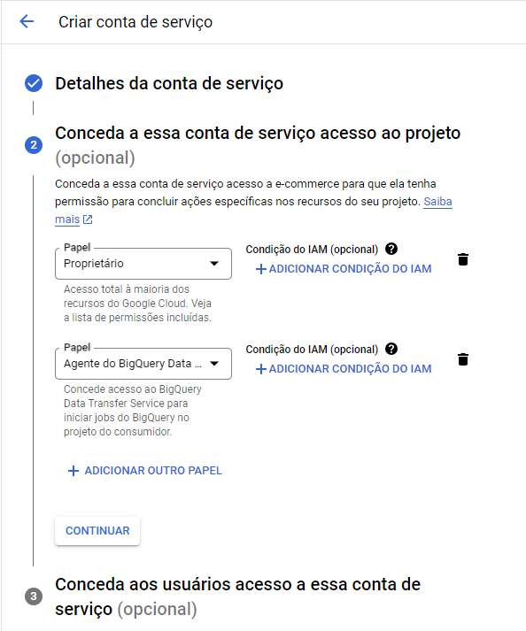
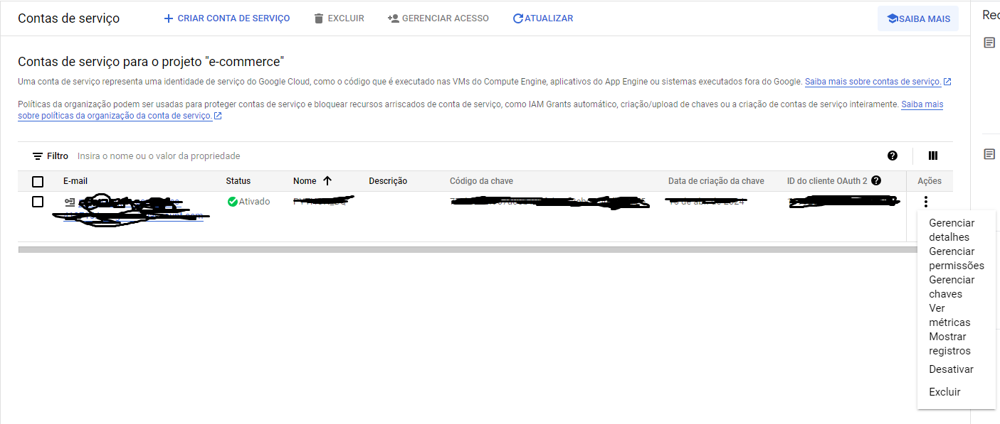
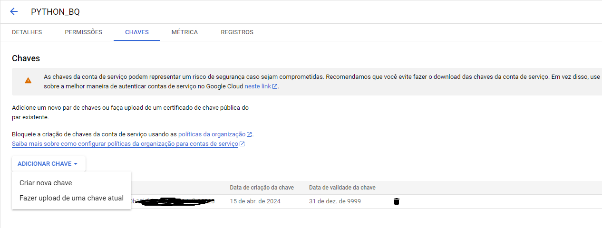

# Configuração das bibliotecas para acessa o dataframe que está com conexão bigquery

### 📋 Pré-requisitos vamos precisar,

* [Python instalado](https://www.python.org/ftp/python/3.12.3/python-3.12.3-amd64.exe).

* [Vscode instalado](https://code.visualstudio.com/sha/download?build=stable&os=win32-x64-user).

#### 1 - Primeiramente vamos precisar criar uma file com exemplo.ipynb instalar as bibliotecas. 

#### 2 - Vamos precisar fazer a estrutura de conexão incluido as bibliotecas importadas no Python Jupyter.

```
%pip install google-cloud-bigquery
%pip install --upgrade google-cloud-bigquery
%pip install pandas_gbq
%pip install pandas
```

#### 3 - Instando os com pacote, vamos precisar acessa o console do google cloud para criar uma conta de serviço para ter acessa a ferramenta externa como o vscode utilizando python jupyter.


Passo:

- [IAM e Adminstrador -> Contas de serviços -> criar conta de serviço.
](https://console.cloud.google.com/iam-admin/serviceaccounts?hl=pt-BR&project=e-commerce-413715)

Em datalhes da conta de serviço colocaremos as informações abaixo,

Exemplo: 


* Nome da Conta de serviço: PYTHON_BQ

* ID da Conta de serviço: PYTHON_BQ

Criar e Continuar

#### 4 - Conceda a essa conta de serviço acesso ao projeto (opcional)



* Papel: Permissão, colocamos básico -> proprietário. (Condição do IAM)
* Papel: Adminstrador do BigQuery. (Condição do IAM)
* Papel: Agente do BigQuery Data Transfer Service. (Condição do IAM)

Continuar e Concluir.

#### 5 - Feito isso vamos criar nossa chave de conexão.



* Clicamos nos 3 pontinho(Ações) - > Gerenciar chaves.

* Adicionar chave -> Criar nova chave no formato de json. criada essa chave ela será baixada no computador local.



#### 6 - Depois de baixa a chave colocaremos dentro de uma pasta chamada Data dentro no nosso projeto.

